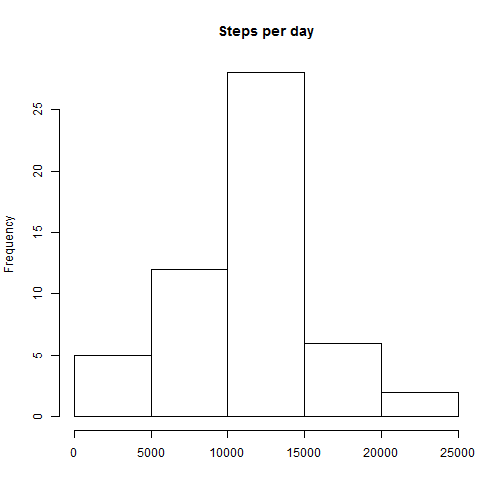
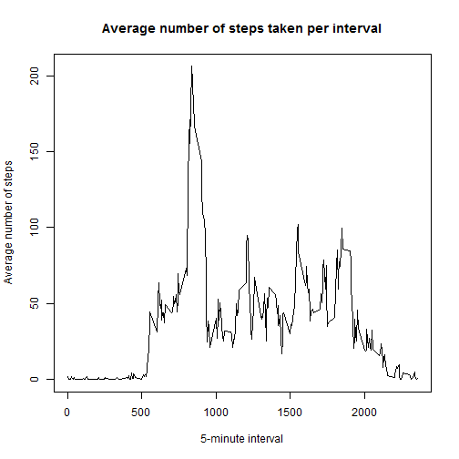
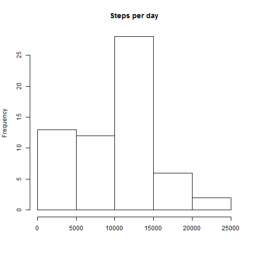
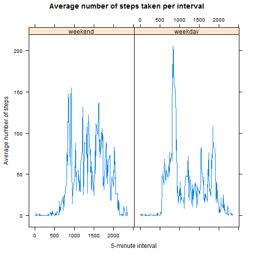

## Loading and preprocessing the data
#### Read the data from file

```r
srcFile <- "activity.csv"
measurements_raw <- read.csv(file = srcFile, header = T, stringsAsFactors = F)
```

#### Transform the data

```r
measurements_raw$date <- as.Date(measurements_raw$date)
measurements <- na.omit(measurements_raw)
```

## What is mean total number of steps taken per day?
#### Total number of steps taken per day

```r
sumOfStepsPerDay <- aggregate(x = measurements$steps, by = list(measurements$date), FUN = sum)
colnames(sumOfStepsPerDay) <- c("Date", "SumOfSteps")

hist(sumOfStepsPerDay$SumOfSteps, main = "Steps per day", xlab = "")
```

 

#### mean and median of the total number of steps taken per day

```r
mean_sumOfSteps <- mean(sumOfStepsPerDay$SumOfSteps, na.rm = T)
mean_sumOfSteps
```

```
## [1] 10766.19
```

```r
median_sumOfSteps <- median(sumOfStepsPerDay$SumOfSteps, na.rm = T)
median_sumOfSteps
```

```
## [1] 10765
```

## What is the average daily activity pattern?

```r
meanOfStepsPerInterval <- aggregate(x = measurements$steps, by = list(measurements$interval), FUN = mean)
colnames(meanOfStepsPerInterval) <- c("Interval", "MeanOfSteps")
plot(meanOfStepsPerInterval$Interval, meanOfStepsPerInterval$MeanOfSteps, 
     type = "l", main = "Average number of steps taken per interval",
     xlab = "5-minute interval", ylab = "Average number of steps")
```

 

#### 5-minute interval that on average across all the days in the dataset, contains the maximum number of steps

```r
meanOfStepsPerInterval$Interval[which.max(meanOfStepsPerInterval$MeanOfSteps)]
```

```
## [1] 835
```

## Imputing missing values
#### Total number of missing values in the dataset

```r
length(which(complete.cases(measurements_raw) == FALSE))
```

```
## [1] 2304
```

#### Strategy for fillinig missing values:
Take the median of the 5-minute interval
    

```r
idx_NAs <- which(is.na(measurements_raw$steps))
measurements_NA <- cbind(idx_NAs, measurements_raw$steps[idx_NAs], measurements_raw$interval[idx_NAs])
na_intervals <- unique(measurements_NA[,3])
for (na_interv in na_intervals) {
    measurements_NA[measurements_NA[,3] == na_interv, 2] <- median(measurements_raw$steps[measurements_raw$interval == na_interv], na.rm = T)
}
    
measurements_raw_afterIMD <- measurements_raw
measurements_raw_afterIMD$steps[measurements_NA[,1]] <- measurements_NA[,2]
```

#### What is mean total number of steps taken per day after imputing missing values?

```r
sumOfStepsPerDay_afterIMD <- aggregate(x = measurements_raw_afterIMD$steps, by = list(measurements_raw_afterIMD$date), FUN = sum)
colnames(sumOfStepsPerDay_afterIMD) <- c("Date", "SumOfSteps")

hist(sumOfStepsPerDay_afterIMD$SumOfSteps, main = "Steps per day", xlab = "")
```

 

```r
mean_sumOfSteps_afterIMD <- mean(sumOfStepsPerDay_afterIMD$SumOfSteps, na.rm = T)
mean_sumOfSteps_afterIMD
```

```
## [1] 9503.869
```

```r
median_sumOfSteps_afterIMD <- median(sumOfStepsPerDay_afterIMD$SumOfSteps, na.rm = T)
median_sumOfSteps_afterIMD
```

```
## [1] 10395
```
Both the mean and the median decrease after imputing missing values.

* mean: 10766.189 --> 9503.869
* median: 10765 --> 10395

## Are there differences in activity patterns between weekdays and weekends?
#### Create new factor variable with two levels - "weekday" and "weekend" indicating whether a given date is a weekday or weekend day

```r
measurements_weekday <- weekdays(measurements_raw_afterIMD$date)
measurements_raw_afterIMD <- cbind(measurements_raw_afterIMD, "kindOfWeekday" = measurements_weekday != "Samstag" & measurements_weekday != "Sonntag")
measurements_raw_afterIMD$kindOfWeekday <- as.factor(measurements_raw_afterIMD$kindOfWeekday)
levels(measurements_raw_afterIMD$kindOfWeekday) <- c("weekend","weekday")
```

#### Panel plot for comparing weekday-days and weekend-days

```r
measurements_kindOfWeekday <- split(measurements_raw_afterIMD, measurements_raw_afterIMD$kindOfWeekday)
meanOfStepsPerInterval_weekday <- aggregate(x = measurements_kindOfWeekday$weekday$steps, by = list(measurements_kindOfWeekday$weekday$interval), FUN = mean)
colnames(meanOfStepsPerInterval_weekday) <- c("Interval", "MeanOfSteps")

meanOfStepsPerInterval_weekend <- aggregate(x = measurements_kindOfWeekday$weekend$steps, by = list(measurements_kindOfWeekday$weekend$interval), FUN = mean)
colnames(meanOfStepsPerInterval_weekend) <- c("Interval", "MeanOfSteps")
    
meanOfStepsPerInterval_weekday <- cbind(meanOfStepsPerInterval_weekday, "kindOfWeekday" = measurements_kindOfWeekday$weekday$kindOfWeekday[1])
meanOfStepsPerInterval_weekend <- cbind(meanOfStepsPerInterval_weekend, "kindOfWeekday" = measurements_kindOfWeekday$weekend$kindOfWeekday[1])
    
meanOfStepsPerInterval_weekday_weekend <- rbind(meanOfStepsPerInterval_weekday, meanOfStepsPerInterval_weekend)
    
library(lattice)
xyplot(MeanOfSteps ~ Interval | kindOfWeekday, meanOfStepsPerInterval_weekday_weekend, type = "l", 
       main = "Average number of steps taken per interval",
       xlab = "5-minute interval", ylab = "Average number of steps")
```

 
